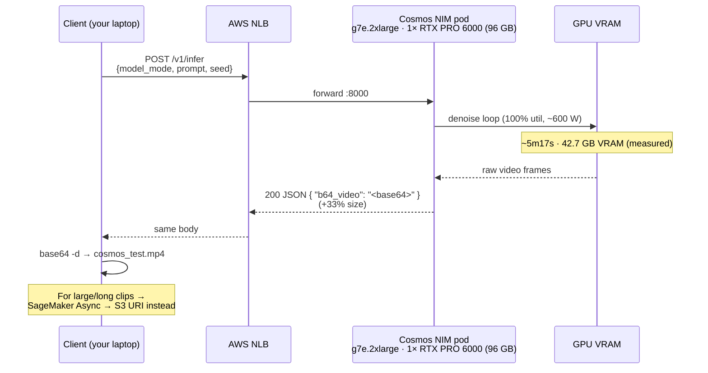

# NVIDIA Cosmos 3 on AWS

Deploy the **NVIDIA Cosmos 3 Generator** NIM — a world foundation model that turns
a **text prompt or a still image** into generated video — on AWS, using the
[`terraform-aws-nim`](../../inference/terraform-aws-nim) module.

This sample deploys the **Generator/nano** tier over HTTP on EKS and has been
**validated end-to-end**: `terraform apply` → healthy pod → `POST /v1/infer`
(`text2video`) → a real MP4 returned inline. See [Measured performance](#measured-performance)
for the numbers we recorded on the actual instance.

| Variant | Path | Serves | Invoke | Status |
|---------|------|--------|--------|--------|
| [`examples/eks/nim/`](examples/eks/nim/) | EKS Auto Mode + **raw kubectl manifest** (no Helm chart) | HTTP :8000 | `POST /v1/infer` → `b64_video` | ✅ Validated end-to-end |
| [`examples/sagemaker/nim/`](examples/sagemaker/nim/) | SageMaker **async** endpoint (Caddy shim) | `/invocations` → `/v1/infer` | `InvokeEndpointAsync` → S3 MP4 | Provided; see [Output: inline vs S3](#how-cosmos-returns-output-inline-vs-s3) |

> **Scope note:** we validated the **`text2video`** path on the Generator/nano
> tier. The `/v1/infer` API is a discriminated union over a `model_mode` field with
> several values (see [Invoking](#invoking-the-endpoint)); we did **not** exercise
> every mode. This sample proves the *deployment mechanism*; for the full mode
> matrix and per-mode request schemas, use the
> [NVIDIA cosmos-cookbook](https://github.com/nvidia-cosmos/cosmos-cookbook) — we
> link it rather than duplicate it.

---

## What Cosmos 3 is

### The shift: separate models → one omnimodal model

Earlier Cosmos releases were **separate, specialized models**, each deployed for a
specific job:

| Earlier Cosmos | Role |
|----------------|------|
| Cosmos-Predict (1 / 2.5) | world / video generation |
| Cosmos-Transfer (2.5) | control-conditioned generation (depth / edge / segmentation) |
| Cosmos-Reason (1) | reasoning vision-language model |

**Cosmos 3 unifies these into a single omnimodal world foundation model** — a
**Mixture-of-Transformer (MoT)** architecture with two cooperating towers that
share latent representations and are trained jointly:

- **Reasoner tower** (vision-language) — understands/grounds the input.
- **Generator tower** (world simulator) — produces the output video.

### How the towers map to NIMs (you deploy ONE for video)

The **`cosmos3` Generator NIM is self-contained** — it runs *both* towers in one
container (reasoner grounds your prompt/image, generator makes the video). **For
video generation you deploy this one NIM.** The separate **`cosmos3-reasoner` NIM**
exposes the reasoner path standalone (text→text) — deploy it only if you also want
standalone reasoning.

You can see both towers in a single running pod (`nvidia-smi` process list) — a
diffusion `python3` process (the Generator) and a `VLLM::EngineCore` process (the
Reasoner). See [Measured performance](#measured-performance).

---

## Two levers: deploy-time vs invoke-time

A common point of confusion (especially coming from LLMs, where there's one knob).
The Cosmos 3 **generator** has two levers at two layers:

| Lever | Set where | Set when | Selects |
|-------|-----------|----------|---------|
| `NIM_MODEL_VARIANT` (`nano` 8B / `super` 32B) | **env var** (module's `env` passthrough) | **deploy time** | which model size loads into VRAM |
| `model_mode` (`text2video`, `image2video`, …) | **request JSON field** | **invoke time** | which operation this one call runs |

**Consequence:** you do **not** redeploy to switch modes. One generator deployment
exposes all the `/v1/infer` model_modes — you just change the request field.

**The reasoner is a *separate deployment*, not a lever.** Standalone reasoning (text /
scoring via `/v1/chat/completions`) is a **different NIM image**
(`nvcr.io/nim/nvidia/cosmos3-reasoner`) — not an env switch on the generator image. See
[How the towers map to NIMs](#how-the-towers-map-to-nims-you-deploy-one-for-video).

This sample sets the deploy-time size in
[`examples/eks/nim/main.tf`](examples/eks/nim/main.tf):

```hcl
env = { NIM_MODEL_VARIANT = "nano" }
```

---

## How Cosmos returns output (inline vs S3)

This trips up anyone arriving from text LLMs, so it's worth being explicit.

The NIM's `/v1/infer` is a **synchronous HTTP endpoint**, and it has exactly **one**
way to return a video: **inline in the JSON response as base64** (`b64_video`). The
NIM is a stateless container — it has **no concept of your S3 buckets or
filesystems** and never writes a file anywhere. All persistence happens on **your**
side of the wire.

That reframes "where does the video go?" as *"what does the client (or a layer in
front) do with the response?"*:

| Option | How | When to use | Ceiling |
|--------|-----|-------------|---------|
| **A. base64 inline** (this sample) | client decodes `b64_video` → local `.mp4` | short clips, dev, demos | ~tens of MB before the JSON body gets unwieldy; +33% base64 inflation; whole clip buffered in RAM both ends |
| **B. decode → `aws s3 cp`** | same call, client uploads the decoded file | you want it in S3 but the clip is still small | same size ceiling as A |
| **C. SageMaker Async Inference** | POST → runs async → **writes the output object to S3** → returns an S3 URI | large/long clips, minute-scale jobs, production | the purpose-built AWS answer for big, slow payloads |

> **You cannot "mount an S3 drive and have the NIM write there."** The NIM returns
> base64 in the HTTP body; a mounted volume has nothing to receive. On EKS, **base64
> inline is the only transport.** For S3-backed large outputs, use the SageMaker
> async path (or a thin gateway that decodes-and-uploads).

For the general treatment of this across EKS / SageMaker realtime / async (and the 6 MB /
60 s realtime caps), see the module's
[Output transport — inline vs S3](../../inference/terraform-aws-nim/README.md#output-transport--inline-vs-s3).



---

## Instance selection

Cosmos 3 Generator requires **Hopper architecture or newer (CC ≥ 9.0)** and, per
NVIDIA's [support matrix](https://docs.nvidia.com/nim/cosmos/latest/support-matrix.html),
a **minimum per-device VRAM** — an architecture floor, not just a memory floor:

| Tier | Min VRAM / device | Fits single GPU? |
|------|-------------------|------------------|
| **Generator / nano** (8B) | **≥ 79 GiB** | ✅ on a 96 GB card |
| Generator / super (32B) | ≥ 121 GiB (FP8) · ≥ 150 GiB (BF16) · ≥ 131 GiB (NVFP4) | ❌ needs multi-GPU tensor-parallel |

NVIDIA explicitly lists **RTX PRO 6000 Blackwell Server Edition (96 GB)** as a
validated Cosmos 3 SKU — that's the GPU in the **`g7e`** family this sample targets:

| AWS instance | GPU | Cosmos 3 nano? | Why |
|--------------|-----|----------------|-----|
| `g4dn`/`g5`/`g6`/`g6e` | T4/A10G/L4/L40S | ❌ | older arch and/or < 79 GB (an L40S's 48 GB is under the floor even though our *measured* use was lower — the device requirement is ≥ 79 GiB) |
| `p4d`/`p4de` | A100 40/80 GB | ❌ | Ampere CC 8.0 < Hopper 9.0 |
| **`g7e.2xlarge`** | **1× RTX PRO 6000 Blackwell 96 GB** | ✅ **default** | validated SKU; clears the ≥ 79 GiB nano floor on **one** GPU (`gpu_count = 1`); far cheaper than 8× H100 |
| `g7e.12xl/24xl/48xl` | 2/4/8× RTX PRO 6000 | ✅ (super) | multi-GPU for the super tier — set `gpu_count` |
| `p5`/`p5e`/`p5en` | 8× H100/H200 | ✅ | also valid; 8-GPU nodes (~$98/hr for p5) |

> **Precision:** the RTX PRO 6000 is Blackwell, so it supports **BF16, FP8, and
> NVFP4** (NVFP4 requires Blackwell, CC ≥ 10.0). Nano supports all three.

### How the sample expresses this

Rather than pinning an exact instance type, the sample declares the *requirement* and lets
EKS Auto Mode (managed Karpenter) pick the cheapest `g7e` size with capacity, across AZs:

```hcl
eks_clusters    = { cosmos = { node_pool = { instance_families = ["g7e"] } } }         # allow-list
eks_deployments = { nim = { cosmos3 = { node_selection = { min_gpu_memory_gib = 79 } } } } # the need
```

Pin exactly instead with `node_selection = { instance_types = ["g7e.2xlarge"] }`. For the
super (32B) tier, add larger `g7e` sizes / `p5` families and set `gpu_count > 1` (tensor-
parallel). See the module README's [GPU node selection](../../inference/terraform-aws-nim/README.md#gpu-node-selection)
for the full knob set (VRAM band, denylist, capacity reservations, cost caps).

**Reasoner sizing** (separate `cosmos3-reasoner` NIM): the ~8B VLM runs on an **L40S (48 GB,
FP8)** — much cheaper than the generator. On EKS use `node_selection = { instance_families =
["g6e"] }`; on SageMaker, `ml.g6e.2xlarge`.

---

## Measured performance

Real numbers recorded on this sample's default deployment — **`text2video`,
default params (`prompt` + `seed` only), Generator/nano, `g7e.2xlarge`**. NVIDIA
publishes no latency benchmarks, so these are our own empirical measurements; treat
them as a starting point and benchmark your own params.

| Metric | Value | Note |
|--------|-------|------|
| Wall-clock (1 clip) | **~5 min 17 s** | fully GPU-bound (see util) — not I/O |
| Output file | **1.95 MB** MP4 | for the default clip length/resolution |
| Response payload | **2.54 MB** base64 | ~33% larger than the file (base64 inflation) |
| VRAM used (during gen) | **42.7 GB / 96 GB** | steady-state; NVIDIA still *requires* a ≥ 79 GiB device |
| GPU utilization | **100%** | compute-bound |
| Power | **~599 W** (of 600 W cap) | at TDP |

**Dual-tower footprint, from the pod's `nvidia-smi` process list:**

| Process | VRAM | Tower |
|---------|------|-------|
| `python3` | 36.8 GB | Generator (diffusion) — the big consumer |
| `VLLM::EngineCore` | 5.3 GB | Reasoner (LLM, served by vLLM) |
| `tritonserver` | 0.6 GB | serving harness |

**What drives generation time & VRAM** (tune these; benchmark the result):

| Knob | Effect on time | Effect on VRAM |
|------|----------------|----------------|
| `num_output_frames` (clip length) | more frames → slower | higher |
| `resolution` | higher → slower | higher |
| `steps` (inference steps) | ~linear | small |
| precision (BF16 → FP8 → NVFP4) | lower precision → faster | lower |

> The NIM's request timeout (`NIM_TRITON_REQUEST_TIMEOUT`) defaults to **30 minutes**
> — which is why a multi-minute generation completes without the connection being
> dropped.

---

## Deploy

```bash
cd examples/eks/nim
cp terraform.tfvars.example terraform.tfvars   # set ngc_secret_name (standard nvapi-* key)
terraform init && terraform apply
```

First apply is ~20 min (cluster + GPU node + image sync, mostly parallel). The pod
may sit `0/1 Running` for several minutes after apply returns while the model loads.

Watch it come up:

```bash
aws eks update-kubeconfig --name cosmos-dev-cosmos --region <region>
kubectl get pods -n cosmos3 -w   # ctrl-C when READY=1/1
```

---

## Invoking the endpoint

Get the NLB hostname (internet-facing, restricted to your IP by the sample):

```bash
LB=$(kubectl get svc -n cosmos3 \
  -o jsonpath='{range .items[*]}{.status.loadBalancer.ingress[0].hostname}{end}')
```

`/v1/infer` is a **discriminated union** — the request **must** include a
`model_mode` field (omitting it returns HTTP 422:
`Unable to extract tag using discriminator 'model_mode'`). It also **rejects unknown
fields**.

**Validated call — `text2video`:**

```bash
curl -X POST "http://$LB:8000/v1/infer" \
  -H 'Content-Type: application/json' \
  -d '{"model_mode":"text2video","prompt":"A vintage sports car on a coastal cliff road at sunset","seed":42}' \
  -o out.json -w "infer: %{http_code}\n"

# Decode the inline base64 video → local MP4
jq -r '.b64_video' out.json | base64 -d > cosmos_test.mp4
```

Response shape: `{ "b64_video": "<base64 MP4>", "seed": 42, ... }`.

> **Output format — the video is VP9, not H.264.** Cosmos returns a **VP9-in-MP4**
> clip (validated: `1280×720`, `24 fps`, ~8 s / 189 frames for the default params).
> **macOS QuickTime can't play VP9** and will say "not compatible" — the file is fine.
> Play it in **VLC** or **Chrome**, or transcode to H.264:
> ```bash
> ffmpeg -i cosmos_test.mp4 -c:v libx264 -pix_fmt yuv420p cosmos_h264.mp4
> ```

**`model_mode` values accepted by `/v1/infer`** (per the cosmos-cookbook API
reference — we validated `text2video` only; which modes a given tower/variant serves
is documented in the cookbook):

| `model_mode` | Input | Output |
|--------------|-------|--------|
| `text2image` | prompt | image |
| **`text2video`** ✅ | prompt | video |
| `image2video` | prompt + image | video |
| `video2video` | prompt + video | video |
| `forward_dynamics` | state + action | predicted next state |
| `inverse_dynamics` | states | inferred action |
| `policy` | goal/observation | action |

> For each mode's exact request schema and optional params (`steps`, `resolution`,
> `num_output_frames`, `guidance_scale`, `negative_prompt`, `image`, …), see the
> [cosmos-cookbook](https://github.com/nvidia-cosmos/cosmos-cookbook). We link it
> rather than copy it — it's the canonical source and it moves.

Health: `GET /v1/health/live` and `GET /v1/health/ready`.

### SageMaker async (input + output via S3)

The NIM still only returns inline base64; **SageMaker async** is what captures that
response and writes it to S3. You upload the request JSON to S3, invoke async, and
SageMaker drops the response at an S3 `OutputLocation`:

```bash
ENDPOINT=$(terraform -chdir=examples/sagemaker/nim output -raw endpoint_name)
echo '{"model_mode":"text2video","prompt":"A drone shot over a snow-capped mountain range","seed":42}' > req.json
aws s3 cp req.json s3://<your-bucket>/cosmos-in/req.json

aws sagemaker-runtime invoke-endpoint-async \
  --endpoint-name "$ENDPOINT" \
  --content-type application/json \
  --input-location s3://<your-bucket>/cosmos-in/req.json \
  --region <region>

# Poll the returned OutputLocation, then decode
aws s3 cp <OutputLocation> out.json
jq -r '.b64_video' out.json | base64 -d > cosmos_async.mp4
```

---

## Observing the deployment

**Live GPU usage** (VRAM, util, power) — run during a generation to confirm you're
sized right and see headroom:

```bash
POD=$(kubectl get pod -n cosmos3 -l app.kubernetes.io/instance=cosmos-dev-cosmos3-nim \
  -o jsonpath='{.items[0].metadata.name}')
kubectl exec -n cosmos3 "$POD" -- nvidia-smi
```

**Prometheus metrics** (the programmatic equivalent): `GET /v1/metrics` on the pod.

---

## Before you apply

- **NGC key:** the Cosmos image is **public GA** (`nvcr.io/nim/nvidia/cosmos3`), so a
  **standard `nvapi-*` NGC key** works. Store it in Secrets Manager and set
  `ngc_secret_name` (Path A), or pass `ngc_api_key` for dev (Path B). An invalid key
  fails at **base-sync**, not at plan.
- **Quota:** you need G-instance vCPU quota for `g7e.2xlarge` in your target region.
  Check Service Quotas and request an increase if needed.
- **GA image, no chart:** Cosmos has **no Helm chart**. The module deploys it via its
  raw-kubectl `Deployment`+`Service` path (`nim_type = "custom"`, `protocol = "http"`,
  no `helm_chart_*`).

---

## Troubleshooting

| Symptom | Cause | Fix |
|---------|-------|-----|
| `422 Unable to extract tag using discriminator 'model_mode'` | request missing `model_mode` | add `"model_mode":"text2video"` (or another mode) |
| `422` on an otherwise-valid body | unknown/extra field | `/v1/infer` rejects unknown fields — remove them |
| `denied` / `unauthorized` at base-sync | bad or unentitled NGC key | use a valid `nvapi-*` key with catalog access |
| `InsufficientInstanceCapacity` | no g7e capacity in the AZs | try another region; the VPC already spreads AZs; verify G quota |
| Pod stuck `0/1 Running` after apply | model still loading on cold start | wait; `kubectl get pods -n cosmos3 -w` |
| Generation returns but the MP4 is huge / client OOM | inline base64 ceiling | switch to the SageMaker async → S3 path |

---

## Teardown

```bash
terraform -chdir=examples/eks/nim destroy        # or examples/sagemaker/nim
```

Do this promptly — an idle GPU node still bills.
